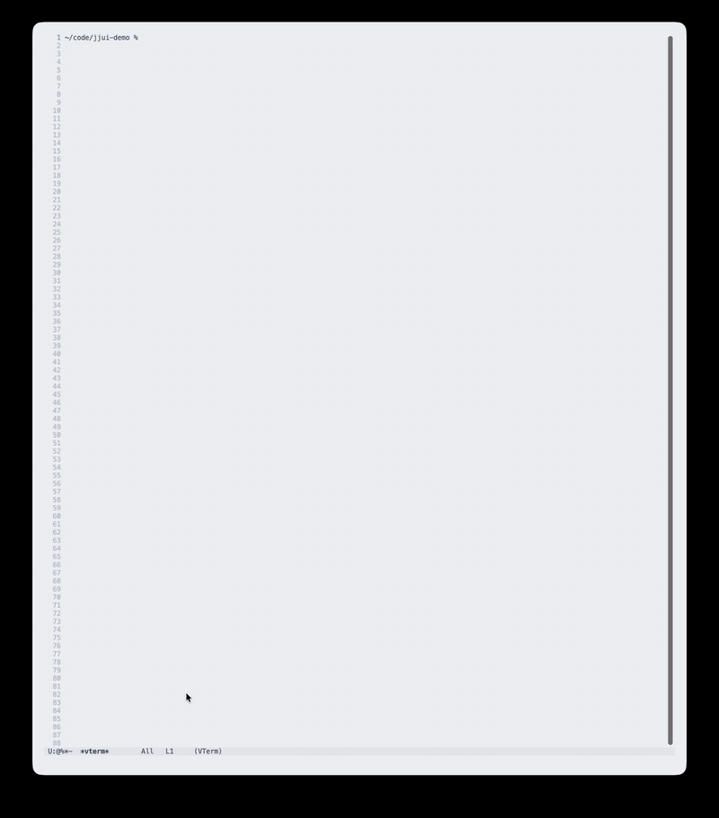

# majjic

Magit-style Emacs UI for Jujutsu.

[Screen recording](./majjic-demo.mov)

## Commands

- `M-x majjic` open the log
- `TAB` expand or collapse a revision, file, or hunk
- `RET` open a file or jump from a hunk line
- `n` / `p` move through visible sections
- `M-n` / `M-p` move between siblings
- `^` jump to parent section
- `N` create a new child of the current revision and move to `@`
- `e` edit the current revision and move to `@`
- `a` enter abandon mode; in abandon mode, `SPC` toggles a revision, `RET` applies, and `C-g` cancels
- `g` refresh
